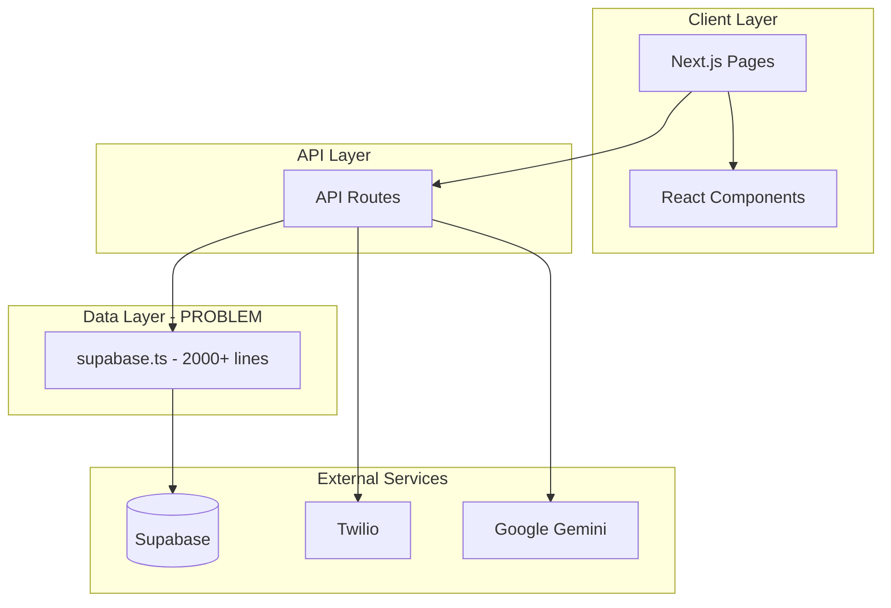
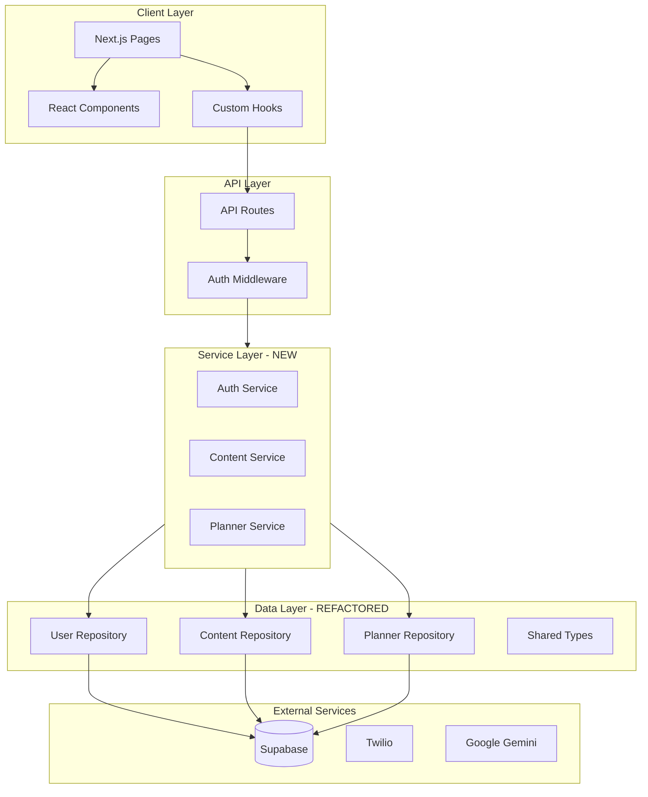

# Codebase Health Assessment and Improvement Plan

## Executive Summary

This is a Next.js 16 application that allows users to save content from TikTok, Instagram, and websites via SMS (Twilio) and organize it using a weekly planner. The codebase is functional but has accumulated technical debt that should be addressed to ensure long-term maintainability and security.**Overall Health: C+** - The app works but has significant architectural issues, security vulnerabilities, and code duplication that will become increasingly problematic as the codebase grows.---

## Critical Issues (Fix Immediately)

### 1. Insecure Session Management - SECURITY RISK

The current session implementation uses a base64-encoded JSON object that can be trivially forged by any attacker:

```46:52:src/app/api/auth/verify/route.ts
// Create a simple session token (in production, use a proper JWT)
const sessionToken = Buffer.from(
  JSON.stringify({
    userId: user.id,
    phoneNumber: normalizedPhone,
    exp: Date.now() + 7 * 24 * 60 * 60 * 1000, // 7 days
  })
).toString("base64");
```

**Problem:** An attacker can decode this token, modify the `userId`, re-encode it, and impersonate any user.**Task for AI Agent:**> Replace the current base64 session token with signed JWTs using the `jose` library. Create a new utility file `src/lib/auth.ts` that exports `createSessionToken(userId, phoneNumber)` and `verifySessionToken(token)` functions. Use `HS256` with a `JWT_SECRET` environment variable. Update all session creation and validation code to use these new utilities.

### 2. Missing Twilio Webhook Signature Validation - SECURITY RISK

The Twilio webhook endpoint has a `validateTwilioRequest` function but never uses it:

```26:173:src/app/api/twilio/webhook/route.ts
export async function POST(request: NextRequest) {
  // No signature validation here!
```

**Task for AI Agent:**> Add Twilio webhook signature validation to `src/app/api/twilio/webhook/route.ts`. Import `validateTwilioRequest` from `@/lib/twilio` and validate the `X-Twilio-Signature` header against the request URL and form data. Return 403 if validation fails. Skip validation only in development mode when `process.env.NODE_ENV !== 'production'`.

### 3. Duplicated Session Validation Logic

The `getSessionUser()` function is copy-pasted across multiple API routes:

- [`src/app/api/content/route.ts`](src/app/api/content/route.ts) (lines 17-39)
- [`src/app/api/auth/session/route.ts`](src/app/api/auth/session/route.ts) (lines 10-26)
- Other route files

**Task for AI Agent:**> Create a centralized session utility in `src/lib/auth.ts` with a single `getSessionUser()` function that returns `{ userId: string, phoneNumber: string } | null`. Create a higher-order function `withAuth(handler)` that wraps API route handlers and automatically returns 401 if not authenticated. Update all API routes to use this centralized auth utility.---

## High Priority Issues

### 4. The 2000+ Line God File: `supabase.ts`

[`src/lib/supabase.ts`](src/lib/supabase.ts) is a 2040-line file containing:

- Type definitions (lines 47-197)
- Client factories (lines 199-226)
- User operations (lines 228-280)
- Content operations (lines 282-430)
- Verification operations (lines 429-488)
- Weekly planner operations (lines 490-720)
- Gift operations (lines 724-928)
- Tag operations (lines 930-1118)
- User settings operations (lines 1120-1164)
- Friends operations (lines 1209-1343)
- Plan sharing operations (lines 1345-1650)
- Storage operations (lines 1649-1783)
- Plan item sharing operations (lines 1785-2040)

**Task for AI Agent:**> Refactor `src/lib/supabase.ts` into a proper module structure:> 1. Create `src/lib/db/types.ts` - all TypeScript interfaces/types> 2. Create `src/lib/db/client.ts` - `createBrowserClient()` and `createServerClient()`> 3. Create `src/lib/db/users.ts` - user CRUD operations> 4. Create `src/lib/db/content.ts` - content CRUD operations> 5. Create `src/lib/db/planner.ts` - weekly planner operations> 6. Create `src/lib/db/gifts.ts` - gift recipient/assignment operations> 7. Create `src/lib/db/tags.ts` - tag operations> 8. Create `src/lib/db/friends.ts` - friends operations> 9. Create `src/lib/db/sharing.ts` - plan sharing operations> 10. Create `src/lib/db/storage.ts` - thumbnail storage operations> 11. Create `src/lib/db/index.ts` - re-export everything for backwards compatibility> Update imports in all consuming files.

### 5. Duplicated Phone Number Normalization

The `normalizePhoneNumber` function exists in two places with identical implementations:

```29:44:src/lib/supabase.ts
export function normalizePhoneNumber(phoneNumber: string): string {
```


```198:213:src/lib/twilio.ts
export function normalizePhoneNumber(phoneNumber: string): string {
```

**Task for AI Agent:**> Remove the duplicate `normalizePhoneNumber` function from `src/lib/supabase.ts`. Keep only the version in `src/lib/twilio.ts` and update all imports in files that were using the supabase version (like `src/app/api/auth/verify/route.ts`).

### 6. Duplicated URL Extraction Logic

URL extraction functions exist in both `twilio.ts` and `social-media.ts`:

```123:164:src/lib/social-media.ts
export function extractSocialMediaUrl(text: string)
```


```173:195:src/lib/twilio.ts
export function extractSocialMediaUrl(messageBody: string)
```

**Task for AI Agent:**> Remove the URL extraction functions from `src/lib/twilio.ts` (`extractTikTokUrl`, `extractInstagramUrl`, `extractWebsiteUrl`, `extractSocialMediaUrl`). Use only the version from `src/lib/social-media.ts`. Update the import in `src/app/api/twilio/webhook/route.ts` to use `extractSocialMediaUrl` from `@/lib/social-media`.

### 7. Duplicated Google Maps URL Helper

The `getGoogleMapsUrl` function is duplicated:

```19:23:src/components/content-card.tsx
function getGoogleMapsUrl(location: string): string {
  return `https://www.google.com/maps/search/?api=1&query=${encodeURIComponent(location)}`;
}
```


```25:29:src/app/dashboard/[id]/page.tsx
function getGoogleMapsUrl(location: string): string {
  return `https://www.google.com/maps/search/?api=1&query=${encodeURIComponent(location)}`;
}
```

**Task for AI Agent:**> Move `getGoogleMapsUrl` to `src/lib/utils.ts` and export it. Remove the duplicate definitions from `src/components/content-card.tsx` and `src/app/dashboard/[id]/page.tsx`, and update both files to import from `@/lib/utils`.

### 8. Duplicated Category Configuration

Category emojis and configuration are defined in multiple places:

```46:54:src/lib/constants.ts
export const CATEGORY_EMOJI: Record<string, string> = { ... }
```


```30:35:src/app/dashboard/planner/page.tsx
const CATEGORY_EMOJI: Record<string, string> = { ... }
```

**Task for AI Agent:**> Remove the local `CATEGORY_EMOJI` constant from `src/app/dashboard/planner/page.tsx` and import it from `@/lib/constants` instead. Search for any other files with local category emoji definitions and consolidate them to use the constants file.---

## Medium Priority Issues

### 9. Large Component Files Need Splitting

[`src/components/content-card.tsx`](src/components/content-card.tsx) is 780+ lines with 10+ sub-components defined inline.**Task for AI Agent:**> Split `src/components/content-card.tsx` into:> 1. `src/components/cards/base-card.tsx` - shared card structure and utilities (`getRotation`, `getWashiColor`, `CardTags`)> 2. `src/components/cards/processing-card.tsx` - ProcessingCard component> 3. `src/components/cards/failed-card.tsx` - FailedCard component> 4. `src/components/cards/meal-card.tsx` - MealCard component> 5. `src/components/cards/drink-card.tsx` - DrinkCard component> 6. `src/components/cards/event-card.tsx` - EventCard component> 7. `src/components/cards/date-idea-card.tsx` - DateIdeaCard component> 8. `src/components/cards/gift-idea-card.tsx` - GiftIdeaCard component> 9. `src/components/cards/travel-card.tsx` - TravelCard component> 10. `src/components/cards/other-card.tsx` - OtherCard component> 11. Keep `src/components/content-card.tsx` as the main export that imports and switches between cards

### 10. SessionData Interface Duplication

The `SessionData` interface is defined identically in multiple files:

```12:16:src/app/api/content/route.ts
interface SessionData {
  userId: string;
  phoneNumber: string;
  exp: number;
}
```


```5:9:src/app/api/auth/session/route.ts
interface SessionData {
  userId: string;
  phoneNumber: string;
  exp: number;
}
```

**Task for AI Agent:**> Move the `SessionData` interface to the centralized `src/lib/auth.ts` file (created in task 3) and export it. Remove all local definitions from API route files and import from `@/lib/auth`.

### 11. Replace Console.log with Proper Logging

The codebase has 50+ `console.log` statements scattered throughout. In production, these should use a structured logging library.**Task for AI Agent:**> Create `src/lib/logger.ts` with a simple logging utility that:> 1. Wraps console methods (log, error, warn, info)> 2. Adds timestamps> 3. Can be configured to be silent in tests> 4. Exports: `logger.info()`, `logger.error()`, `logger.warn()`, `logger.debug()`> Replace all `console.log` and `console.error` calls in `src/lib/*.ts` and `src/app/api/**/*.ts` with the appropriate logger method.

### 12. Missing Error Boundaries

The app has no React error boundaries, meaning any component error crashes the entire page.**Task for AI Agent:**> Create `src/components/error-boundary.tsx` using React's error boundary pattern with a fallback UI that shows "Something went wrong" with a "Try Again" button. Wrap the main content in `src/app/layout.tsx` with this error boundary.

### 13. useSession Hook Missing Dependencies Warning

The `useSession` hook may cause stale closure issues:

```14:35:src/app/dashboard/useSession.ts
useEffect(() => {
  // ...
}, [router, onSuccess, onFinishLoading]); // These callbacks may change on every render
```

**Task for AI Agent:**> Update `src/app/dashboard/useSession.ts` to use `useCallback` internally or document that callers must memoize their callbacks. Consider changing the API to accept a ref or use a more stable pattern. Add `eslint-disable-next-line react-hooks/exhaustive-deps` with a comment explaining why if intentional.---

## Low Priority Issues (Nice to Have)

### 14. Add Input Validation Library

Currently, API inputs are validated ad-hoc. A schema validation library would improve consistency.**Task for AI Agent:**> Install `zod` (`npm install zod`). Create `src/lib/validations.ts` with schemas for:> 1. `PhoneNumberSchema` - validates E.164 format> 2. `VerifyCodeSchema` - validates 6-digit code> 3. `ContentIdSchema` - validates UUID format> Use these schemas in the auth API routes (`send-code`, `verify`) to validate request bodies.

### 15. Add API Rate Limiting

No rate limiting exists on sensitive endpoints like auth.**Task for AI Agent:**> Create a simple in-memory rate limiter in `src/lib/rate-limit.ts` using a Map with IP/phone as key and request count + timestamp. Add a `rateLimit(identifier: string, limit: number, windowMs: number)` function. Apply to `src/app/api/auth/send-code/route.ts` with 5 requests per phone per 10 minutes.

### 16. Add Pagination to Content Fetching

The content API returns all user content without pagination, which will become slow as users accumulate content.**Task for AI Agent:**> Update `src/app/api/content/route.ts` to accept `limit` and `offset` query parameters (default limit=50). Update `getContentByUser` and `getContentWithTags` in the database layer to accept pagination parameters. Update the dashboard to implement infinite scroll or "Load More" button.

### 17. Remove eslint-disable Comments

Several files use `eslint-disable` comments that should be fixed properly:

```546:547:src/lib/gemini.ts
// eslint-disable-next-line @typescript-eslint/no-explicit-any
] as any,
```


```1007:1008:src/lib/supabase.ts
// eslint-disable-next-line @typescript-eslint/no-explicit-any
return (data || []).map((ct: any) => ct.tag as Tag);
```

**Task for AI Agent:**> Fix the type issues that require `eslint-disable` comments:> 1. In `src/lib/gemini.ts`, create a proper type for the Google AI tools configuration> 2. In `src/lib/supabase.ts`, add proper types for the Supabase query responses using generics> Remove the eslint-disable comments once proper types are in place.

### 18. Consolidate LocationLink Component

The `LocationLink` component could be shared:

```26:41:src/components/content-card.tsx
function LocationLink({ location }: { location: string }) {
  return (
    <a href={getGoogleMapsUrl(location)} ... >
```

**Task for AI Agent:**> Extract `LocationLink` from `src/components/content-card.tsx` to `src/components/location-link.tsx` and export it. Use the shared `getGoogleMapsUrl` from utils. Import and use in both content-card.tsx and the detail page.---

## Architecture Recommendations

### Current Architecture




### Recommended Architecture



---

## Summary Table

| Priority | Issue | Impact | Effort ||----------|-------|--------|--------|| CRITICAL | Insecure session tokens | Security breach | Medium || CRITICAL | Missing webhook validation | Security breach | Low || CRITICAL | Duplicated session validation | Maintainability | Medium || HIGH | supabase.ts god file | Maintainability | High || HIGH | Duplicated normalizePhoneNumber | Maintainability | Low || HIGH | Duplicated URL extraction | Maintainability | Low || HIGH | Duplicated getGoogleMapsUrl | Maintainability | Low || HIGH | Duplicated category config | Maintainability | Low || MEDIUM | Large content-card.tsx | Maintainability | Medium || MEDIUM | SessionData duplication | Type safety | Low || MEDIUM | Console.log everywhere | Observability | Medium || MEDIUM | No error boundaries | UX | Low || MEDIUM | useSession dependencies | Reliability | Low || LOW | No input validation | Security/UX | Medium || LOW | No rate limiting | Security | Medium || LOW | No pagination | Performance | Medium |